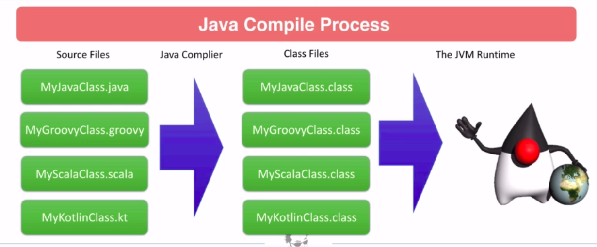
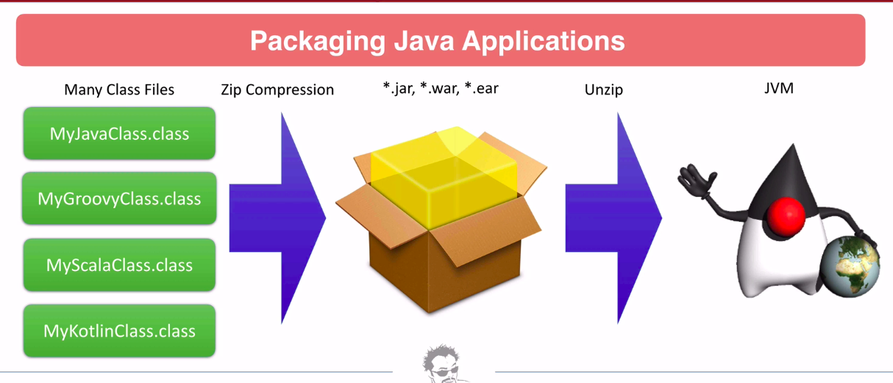

# Course link
[Apacha Maven: Begginner To Guru](https://www.udemy.com/course/apache-maven-beginner-to-guru)


# Why use Apache Maven?

* 70% of the build tool market for Java Application
* 20% Gradle
* 10% Ant
* Quick Project Setup
* Projects are modular
* Mature Dependency Management
* Mature build lifecycle
* Robust plugin community

# Apache Maven - De Facto Standard

* Apacha maven has stabilished 'standards' used by other build tools
  * **Maven Standard Directory Layout** - In most part adapted by other tools such as Gradle
  * **Artifact Naming** - Apache Maven helped estabilish how Java artifacts are named.
  * **Artifcat Repository** - Apache Maven estabilished the structure of artifact repositories
* Prior to Maven these 'standards' did not exist
* New build tools are compatible with these 'standards'

# Maven Disvantages

* Projects are described in and XML document, constrained by an XML Schema.
  * Some consider XML 'dated'
* Gradle uses a Groovy DSL, which can offer greater build flexibility
  * Rare the additional flexibility is needed


# Installing Maven on POSIX compatible Operating System (Linux and Mac OS X)

* To install Maven on a POSIX compatible Operating System, such as Linux or Mac OS X
* Ensure JAVA_HOME is set.
  * echo $JAVA_HOME
* Download the binary archive from a download mirror.

* Switch the Maven contents.
  * mv Downloads/apache-maven* /opt/apache-maven

* Add Maven binaries to the PATH and append.
  * export PATH=/opt/apache-maven-3.6.0/bin:$PATH

* Open a new terminal window and type this command.
  * mvn -v
  * This command displays the version information and verifies that Maven is installed on your computer.

* Find maven command
  * which mvn

# Java Compile Process


# Packaging Java Applications


# Java Packaging
* *.jar - Java ARchive - Zip file containing one or more Java class files.
  * Simple JAR files are typically collection of class files used to compose applications
    * Typically not a complete application
* *.war - Web Application aRchive - Zip file containing web application. Includes one or more jar files, Java class files, and web resources.
* *.ear - Enterprise aRchive - Zip file containing one more WAR files.
  * WAR, EAR files are typically complete applications which are deployed to application servers
    * Tomcat, Weboss, Websphere, etc
* Fat JAR (aka Uber JAR) - Executable Jar containing all dependencies. (Used by Spring Boot)
  * Fat / Uber Jars are typically complete applications which contain embedded application servers
    * Can be deployed stand alone
* Docker Container - Docker image containing runtime environment, JVM, and Java Package.
  * Docker Images are complete applications which can be deployed stand alone


# Creating Java jar files from Command Line
* jar cf myjar.jar HelloWorld.class
  * Instead of HelloWorld.class its possible use *.class
  * cf = create file
* java -classpath myjar.jar HelloWorld
  * adding myjar.jar in classpath and run HelloWorld class

# Using 3rd Party Jars with command line
* javac -classpath ./lib/* HelloWorld.java
  * Compile adding the libraries in classpath
* java -classpath ./lib/*:./ HelloWorld
  * pick up everything at lib and root folder


# Compiling and Packaging with Maven

* You should have a file named pom.xml at root directory
```
<project>
  <modelVersion>4.0.0</modelVersion>
 
  <groupId>com.mycompany.app</groupId>
  <artifactId>my-module</artifactId>
  <version>1</version>

  <properties>
    <maven.compiler.source>1.6</maven.compiler.source>
    <maven.compiler.target>1.6</maven.compiler.target>
  </properties>

</project>
```

```
<?xml version="1.0" encoding="UTF-8"?>
<project xmlns="http://maven.apache.org/POM/4.0.0"
         xmlns:xsi="http://www.w3.org/2001/XMLSchema-instance"
         xsi:schemaLocation="http://maven.apache.org/POM/4.0.0 http://maven.apache.org/xsd/maven-4.0.0.xsd">
    <modelVersion>4.0.0</modelVersion>

    <groupId>guru.springframework</groupId>
    <artifactId>helloworld</artifactId>
    <version>1.0-SNAPSHOT</version>

    <properties>
        <maven.compiler.source>11</maven.compiler.source>
        <maven.compiler.target>11</maven.compiler.target>
    </properties>

</project>
```

* mvn clean
  * clean the environmnent
  * It will delete target folder, all our build artifacts
* mvn package
  * create a target folder with a jar
* You can run mvn clean package
* unzip JARFILE.jar

# Adding Dependencies in maven

* Inside project tag write:
```
<dependencies>
  <dependency>
    <groupId>org.apache.commons</groupId>
    <artifactId>commons-lang3</artifactId>
    <version>3.8.1</version>
  </dependency>
</dependencies>
```

# Goals
* mvn clean
* mvn validate
* mvn compile
* mvn test
* mvn package
* mvn verify
* mvn install
* mvn site
* mvn deploy

# Questions
* What does pom stand for?
  * Project Object Model

* What is a xsd file?
  * This refers to an XML Schema

* What is the term used for the combination of Group ID, Artifact Id, and Version?
  * Maven Cordinades

* What command can you use to tell what version of Maven you are using?
  * mvn --version

* What command do you use to create a jar file from your Maven project?
  * mvn package

* What directory are build artifacts placed in by Maven?
  * /target

* How do you add a 3rd party JAR to your Maven project?
  * Add a dependency section to the project POM, add the 3rd party JAR using MAVEN coordinates


# Maven Basics

## Maven Coordinates

* Maven Coordinates are used to identify artifacts
* Together, they identify a 'location' in a Maven repository
  * **groupId** - Typically unique to an organization. Often the organization's reverse domain is used. But not always. Can be just 'junit'.
  * **artifactId** - Typically the project name. A descriptor for the artifact.
  * **version** - refers to a specific version of the project.
* **groupId** and **version** can be inherited from a parent POM.

## Maven Versions

* Example - 3.2.1-987-beta
* Major Version - First number - 3
* Minor Version - Second number - 2
* Incremental Version (patch) - third number - 1
* Build Number - from CI Build - 987
* Qualifier - String Qualifier - 'beta'
* Most common in use is just major.minor.incremental (3.2.1)

## Snapshot Versions

* Example - 3.2.1-SNAPSHOT
* The SNAPSHOT suffix is an important qualifier to Maven behavior
  * Tells Maven this is a development version
  * Not stable, and Maven should check for newer versions
  * Maven will first check locally, then check remote repositories
  * By default, Maven will check remote repositories once per day
    * Option is configurable

## Maven Repositories

* Maven Repositories are a location where project artifacts are stored
* Types:
  * Local - Repository on local file system - <user home>/.m2/
  * Central - Public repository

