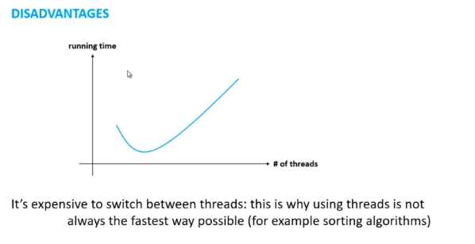
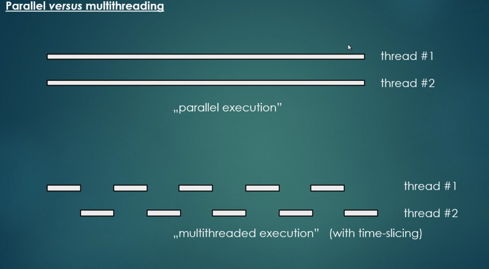
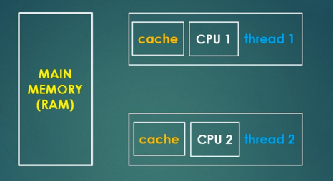

<h1>Multithreading and Parallel Computing in Java</h1>

* link -> https://www.udemy.com/course/multithreading-and-parallel-computing-in-java

<h1>Multithreading Theory</h1>

* What is the motivation behind multithreading?
    * By default programming languages are sequential: they execute the statements and commands one by one (line by line)

    ```java

    public static void main(String[] args) {
        initializeArrays();
        downloadStocks();
        initializeTimeSeriesModels();
        makePredictions();
    }


    ```


    * In single threaded application these methdos will be called one by one: we have to wait for them to finish one by one;;;
    * Npt the best solution possible: time consuming operations may freeze the application and the users may not know what's happening
    * THe most relevant reason for multithreading is to separate multiple tasks: one or more which is time critical and might be subject to interference by the execution of other tasks.
    * For example:
        * Our stock market related software is able to download data from the web (Yahoo FInance for example)
        * It takes 2-3 mins to fetch the data BUT we want to make sure the application is not frozen
        * Solution: we create a distinct thread for the download operation and during this procedure the user can do whatever he/she wants in the application


* Multithreading
    * Multithreading is the ability of the CPU to execute multiple processes or threads concurrently;
    * BOth processes and threads are independent sequences of execution;
    * Process: a process is an instance of program execution
        * When you open a software or a web browser: these are distinct processes
        * The OS assigns distinct registers, stack memory and heap memory to every single process
    * In java o can create processes with the help of ProcessBuilder class;

    * Process
        * -> Registers
        * -> Program Counter
        * -> Stack Memory
        * -> Heap Memory
    
    * THREADS: a thread is a "light-weight" process
        * It is a unit of execution within a given process (a process may have several threads)
        * Each thread in a process shares the memory and resources and this is why programmers have to deal with concurrent programming and multithreading
        * Creating a new thread requires fewer resources than creating a new process
    

<h2>What is time-slicing algorithm?</h2>

* Multithreading and time-slicing algorithm
    * Assume we have k threads (so more than 1 thread in our application)
        * Somehow the single processor has to deal with all of the k threads -> one approach is to use time-slicing algorithm

* Processing time for a single core is shared among processes and threads. This is called time-slicing


* In this case the CPU will run thread #1 for a small amount of time then thread #2 then again thread #1 and then thread #2 and so on....

<h2>Benefits of multithreading</h2>

* Advantages
    * We can design more responsive applications: we can do several operations concorrently.
    * We can achieve better resource utlization (CPU utilization for example) By default every Java program is single threaded: there may be several processor cores which we do not utilize without using multiple threads.
    * Overall we can improve performance
        * // Performance improvement has something to do with multiple cores and parallel computing so we'll discuss it in that chapter.

<h2>Downside of multithreading</h2>

* Disadvantages
    * Of course there are some costs involved in multithreading
        * Multithreading is not always better!!
    * Threads manipulate data located on the same memory area because they belong to the same process and we have to deal with this fact (synchronization)
    * It's not easy to design multithreaded applications (easy to make bugs / hard to detect bugs) - with modern frameworks (fork-join) it's getting easier;
    * Expensive Operation: switching between threads is expensive CPU has to save local data, application pointer etc. of the current thread and has to load the data of the other thread as well.



<h2>Thread life cycle in Java</h2>

* Thread states
    * 1- NEW -> when we instantiate a thread. It is in this state until we start it -> start() method.
    * 2 - RUNNABLE -> After we have started the thread. The thread is executing its task in this state.
    * 3 - WAITING -> When a thread is waiting: for example for another thread to finish its task. When other thread signals then this thread goes back to the runnable state -> wait() and sleep() methods.
    * 4 - DEAD -> After the thread finishes its task.




* Depends of the quantity of processors


<h1>Basic Multithreading</h1>

<h2>Volatile</h2>



* Every read of a volatile variable will be read from the RAM so from the main memory.
    * Not from cache, usually variables are cached for performance reasons.

* Caches are faster -> do not use volatile keyword if not necessary ( + it prevents instruction reordering which is a performance boost technique)


<h2>Deadlock</h2>

* Deadlock is a situation in which two or more competing actions are each waiting for the other to finish, and thus neither ever does.
* Databases -> deadlock happens when two processes each within its own transaction updates two rows of information but in the opposite order. For example, process A updates row 1 then row 2 in the exact timeframe that process B updates row 2 then row 1!!
* Operating system -> a deadlock is a situation which occurs when a process or thread enter a waiting state because a resource requested is being held by another waiting process, which in turn is waiting for another resource held by another waiting process.

<h2>Livelock</h2>

* A thread often acts in response to the action of another thread.
* If the other thread's action is also a response to the action of another thread -> livelock!!
* Livelocked threads are unable to make further progress. However, the threads are not blocked -> they are simply too busy responding to each other to resume work.
* Like two people attempting to pass each other in a narrow corridor: A moves to his left to let B pass, while B moves to his right to let A pass. They are still blocking each other, A moves to his right, while B moves to his left... still not good.

<h2>ReentrantLock</h2>

* It has the same behavior as the "synchronized approach"
* Of course it has some additional features
* new ReentrantLock(boolean fairnessParameter)
* -fairness parameter: if it is set to be true ---> the longest-waiting thread will get the lock
* fairness == false --> there is no access order!!!

* IMPORTANT! -> we have to use try-catch block when doing critical section that may throw exceptions - we call unlock() in the fainlly block.

<h2>Lock VS Synchronization</h2>

* A reentrant lock has the same basic behavior as we have seen for synchronized blocks
    * Of course there are some extended features!!

* We can make a lock fair: prevent thread starvation - Synchronized blocks are unfair by default
* We can check wheter the given lock is held or not with reentrant locks
* We can get the list of threads waiting for the given lock with reentrant locks
* Synchronized blocks are nicer: we do not need the try-catch-finally block

<h2>Semaphores</h2>

* Invented by Dijkstra in 1962
* Semaphores are variables or ADT that are used for controlling access to a common resource
* Important in OS!!
* Semaphores
    * Is a record of how many units of a particular resource are available... wait until a unit of the resource becomes available.

* Counting semaphore: allows an arbitrary resource count
* Binary semaphores: semaphores which are restricted to the values 0 and 1.

* Library Analogy
    * Suppose a library has 10 identical study rooms, to be used by one student at a time. TO prevent disputes, students must request a room from the front desk if they wish to make use of a study room. If no rooms are free, students wait at the desk until someone relinquishes a room. When a student has finished using a room, the student must return to the desk and indicate that one room has become free.

* Semaphore tracks only how many resources are free, it does not keep track of which of the resources are free!!
* The semaphore count may serve as a useful trigger for a number of different actions
* Producer-consumer problem can be implemented with the help of semaphores

* Mutexes
    * A mutex is essentially the same thing as a binary semaphore.
    * While a binary semaphore may be used as a mutex, a mutex is a more specific use-case
        * MUtexes have a concept of an owner. Only the process that locked the mutex is supposed to unlock it.
        * Mutexes may provide pririty inversion safety. If the mutex knows its current owner, it is possbile to promote the priority of the owner whenever a higher-priority task starts waiting on the mutex.
        * MUtex can provide deletion safety.

* Semaphores
    * Maintains a set of permits
    * acquire() -> if a permit is available then takes it
    * release() -> adds a permit
    * Semaphore just keeps a count of the number available
    * new Semaphore(int permits, boolean fair)!!