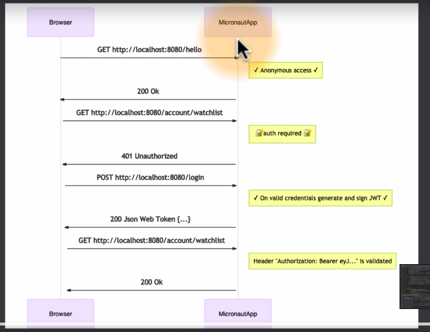
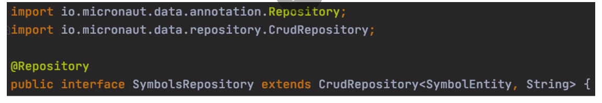
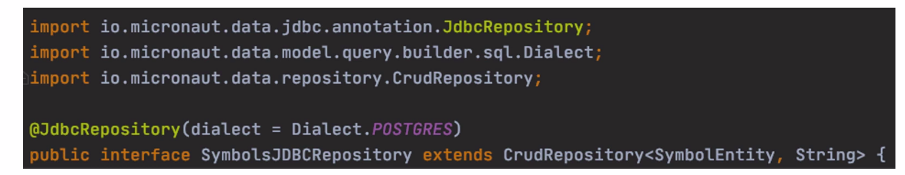

[Course Link](https://www.udemy.com/course/learn-micronaut/)

# Spring / Micronaut / Quarkus

* Spring
  * Pros:
    * Well estabilished framework
    * Reactive Stack with Spring Webflux (since v5)
    * Biggest community
    * Most integrations
    * Multi Language Support (Java, Groovy, Kotlin)
  
  * Cons
    * Heavy use of Reflection
    * Startup time and memory usage not very suiteable for serverless cloud functions
    * Only experimental support for GraalVM

* Quarkus
  * Pros:
    * Modern Cloud Native Framework
    * Reactive Stack
    * Minimal memory footprint and startup time
    * Based on stardards and frameworks (JAX-RS, Netty, Eclipse Microprofile)
    * GraalVM / Serverless cloud functions

  * Cons:
    * O multi Language support in preview (Kotlin, Scala)
    * Slower compilation time (AOT)

* Micronaut
  * Pros:
    * Modern cloud native framework
    * Reactive Stack
    * Minimal memory footprint and startup time
    * No byte code modifications during compilation
    * Removes all levels of reflection usage
    * GraalVM / Serverless cloud functions
    * Multi language support (Java, Groovy, Kotlin)
  
  * Neutral
    * Similar to Spring

  * Cons:
    * Slower compilation time (AOT)
    * Smaller community as Spring

# Bootstrap project

* [Micronaut.io/launch](https://micronaut.io/launch)


# Micronaut Core components

## Dependency Injection
* Also know as Inversion of Control
  * Flexibe loosely coupled components
  * Easier testing
* Micronaut Inject
  * Inspered by Spring DI & Google Dagger
  * Independent (micronaut-inject-java, micronaut-inject-groovy)

* Design Goals
  * Use reflection as a last resort (instead uses annotation processing during compile time)
  * Optimize start-up time
  * Reduce memory footprint
  * Provide clear, understandable error handling

```java

import javax.inject.Singleton;

@Singleton
public class HelloWorldService {

    public String sayHi() {
        return "Hello from service";
    }

}

```

```java
import io.micronaut.http.annotation.Controller;
import io.micronaut.http.annotation.Get;

@Controller("/hello")
public class HelloWorldController {

    private final HelloWorldService helloWorldService;

    public HelloWorldController(HelloWorldService helloWorldService) {
        this.helloWorldService = helloWorldService;
    }

    @Get("/")
    public String index() {
        return helloWorldService.sayHi();
    }

}

```

```java

import io.micronaut.context.ApplicationContext;
import io.micronaut.runtime.Micronaut;

public class Application {

    public static void main(String[] args) {

        ApplicationContext context = Micronaut.run(Application.class, args);
        HelloWorldService service = context.getBean(HelloWorldService.class);
        System.out.println(service.sayHi());
        context.close();
    }
}


```

## Micronaut Configuration

* Application Configuration /src/main/resources:
  * application.yml
  * application.properties
  * application.json
  * application.groovy

* Configure Server Port

```yml
micronaut:
  application:
    name: stockBroker
  server: 8081
```

* Configure Controller Path
```yml
hello:
  controller:
    path: "/hello"

```

```java
//@Controller("${hello.controller.path:/hello}")
@Controller("${hello.controller.path}")
public class HelloWorldController {
}
```

* Value Injection and Property Injection

```yml
hello:
  controller:
    path: "/hello"
  service:
    greeting: "Hello from service"

```

```java
package com.stock.broker;

import io.micronaut.context.annotation.Property;
import io.micronaut.context.annotation.Value;

import javax.inject.Singleton;

@Singleton
public class HelloWorldService {

    //All strings in annotations can come from configuration file
//    @Value("Hello from service")
//    @Value("${hello.service.greeting}")
    @Property(name = "hello.service.greeting", defaultValue = "default value greeting")
    private String greeting;

    public String sayHi() {
        return greeting;
    }

}

```

## Immutable Configuration


```yml
hello:
  config:
    greeting:
      de: "Hallo"
      en: "Hello"
```

```java
package com.stock.broker;

import io.micronaut.context.annotation.ConfigurationInject;
import io.micronaut.context.annotation.ConfigurationProperties;

import javax.validation.constraints.NotBlank;

@ConfigurationProperties("hello.config.greeting")
public class GreetingConfig {

    private final String de;
    private final String en;

    @ConfigurationInject
    public GreetingConfig(@NotBlank final String de, @NotBlank final String en) {
        this.de = de;
        this.en = en;
    }

    public String getDe() {
        return de;
    }

    public String getEn() {
        return en;
    }

}
```

## Logging


```xml

<!-- logback.xml ALL LOGS IN THAT PACKAGE WILL SHOW ONLY IN LEVEL DEBUG-->
<logger name="com.stock.broker" level="DEBUG" />

```

```java
package com.stock.broker;

import io.micronaut.context.annotation.Property;
import io.micronaut.context.annotation.Value;
import io.micronaut.context.event.StartupEvent;
import io.micronaut.runtime.event.annotation.EventListener;
import org.slf4j.Logger;
import org.slf4j.LoggerFactory;

import javax.inject.Singleton;

@Singleton
public class HelloWorldService {

    private static final Logger LOG = LoggerFactory.getLogger(HelloWorldService.class);

    //ITS CALLED WHEN STARTUP
    @EventListener
    public void onStartup(StartupEvent startupEvent) {
        //LEVEL DEBUG
        LOG.debug("Startup: {}", HelloWorldService.class.getSimpleName());
    }

}


```

# Micronaut Web
* Server
  * Netty - based
  * Non-blocking - input output (io)
  * Reactive HTTP Request Processing
  * Json Binding with Jackson
  * Web Sockets
  * HTTP/2
* Client
  * Low level HTTP Client
  * Declartive HTTP Client with @Client
  * Streaming JSON over HTTP
  * Retry and Circuit Breaker

## Stock Broker REST API
* Public Endpoints
  * GET
    * /markets
    * /quotes/{symbol}

* Private Endpoints
  * GET
    * /account/watchlist + /account/watchlist-reactive
  * PUT
    * /account/watchlist +/account/watchlist-reactive
  * DELETE
    * /account/watchlist +/account/watchlist-reactive


## Open API and Swagger
* https://micronaut-projects.github.io/micronaut-openapi/latest/guide/index.html
* pom.xml
```xml
    <dependencies>
    <dependency>
      <groupId>io.swagger.core.v3</groupId>
      <artifactId>swagger-models</artifactId>
      <scope>compile</scope>
    </dependency>
    </dependencies>

    <build>
    <plugins>
      <plugin>
        <groupId>io.micronaut.build</groupId>
        <artifactId>micronaut-maven-plugin</artifactId>
      </plugin>
      
      <plugin>
        <groupId>org.apache.maven.plugins</groupId>
        <artifactId>maven-compiler-plugin</artifactId>
        <configuration>
          <annotationProcessorPaths combine.children="append">
            <path>
              <groupId>org.projectlombok</groupId>
              <artifactId>lombok</artifactId>
              <version>${lombok.version}</version>
            </path>
            <!-- THIS ONE! -->
            <path>
              <groupId>io.micronaut.openapi</groupId>
              <artifactId>micronaut-openapi</artifactId>
              <version>2.6.0</version>
            </path>
            <!-- THIS ONE! -->
          </annotationProcessorPaths>
          <!-- NEED THIS! \/ -->
          <fork>true</fork>
          <!-- NEED THIS! /\ -->
          <compilerArgs>
          <!-- THIS ONE! -->
            <arg>-J-Dmicronaut.openapi.views.spec=redoc.enabled=true,rapidoc.enabled=true,swagger-ui.enabled=true,swagger-ui.theme=flattop</arg>
            <!-- THIS ONE! -->
            <arg>-Amicronaut.processing.group=com.stock.broker</arg>
            <arg>-Amicronaut.processing.module=stock-broker</arg>
          </compilerArgs>
        </configuration>
      </plugin>
    </plugins>
  </build>


```

* application.yml

```yml
micronaut:
  application:
    name: stockBroker
  server:
    port: 8081
  router:
    static-resources:
      swagger:
        paths: classpath:META-INF/swagger
        mapping: /swagger/**
      redoc:
        paths: classpath:META-INF/swagger/views/redoc
        mapping: /redoc/**
      rapidoc:
        paths: classpath:META-INF/swagger/views/rapidoc
        mapping: /rapidoc/**
      swagger-ui:
        paths: classpath:META-INF/swagger/views/swagger-ui
        mapping: /redoc/**

```

* Java Application.class

```java

package com.stock.broker;

import io.micronaut.context.ApplicationContext;
import io.micronaut.runtime.Micronaut;
import io.swagger.v3.oas.annotations.info.Info;
import io.swagger.v3.oas.annotations.info.License;
import org.slf4j.Logger;
import org.slf4j.LoggerFactory;
import io.swagger.v3.oas.annotations.OpenAPIDefinition;

@OpenAPIDefinition(
        info = @Info(
                title = "mn-stock-broker",
                version = "0.1",
                description = "Udemy Micronaut Course",
                license = @License(name = "MIT")
        )
)
public class Application {

    private static final Logger LOG = LoggerFactory.getLogger(Application.class);

    public static void main(String[] args) {
        ApplicationContext context = Micronaut.run(Application.class, args);
        HelloWorldService service = context.getBean(HelloWorldService.class);
        LOG.info(service.sayHi());
//        context.close();
    }
}

```

* http://localhost:8081/swagger-ui
* http://localhost:8081/rapidoc
* http://localhost:8081/redoc


## JSON SETTINGS:

```yml

#JSON Settings
#TYPE OF PROPERTY NAMES = SNAKE CASE like_that
jackson:
 property-naming-strategy: SNAKE_CASE
 serialization:
   writeDatesAsTimestamps: false
   writeDatesWithZoneId: true
   writeDateTimestampsAsNanoseconds: false
 generator:
   writeNumbersAsStrings: true
   writeBigDecimalAsPlain: true
 deserialization:
   failOnUnknownProperties: false

```

## JSON Web Token Authentication (JWT)



* Dependencies

```xml

<dependency>
  <groupId>io.micronaut.security</groupId>
  <artifactId>micronaut-security-jwt</artifactId>
</dependency>
<dependency>
  <groupId>io.micronaut.security</groupId>
  <artifactId>micronaut-security-annotations</artifactId>
</dependency>

 ```

 * To request default /login implementation

 ```
curl -X "POST" "http://localhost:8080/login" \
     -H 'Content-Type: application/json; charset=utf-8' \
     -d $'{
  "username": "euler",
  "password": "password"
}'

 ```

 ## Micronaut Data

 * Precomputed Queries at compilation time
 * Reflection Free AOP -> No runtime overhead
 * Type Safe
 * JPA
  * Hibernate
* JDBC
  * Proprietary by micronaut


## JDBC x JPA

* JDBC
  * More Efficient
  * Fewer Dialects
  * DTOs
  * Optimized Reads
  * Better or Serveless

* Hibernate
  * Greater Memory Requirements
  * More Dialects
  * Single Entity -> Table
  * Optimized Writes
  * Cold start an Issue
 
* Benchmarks
  * https://github.com/micronaut-projects/micronaut-data/tree/master/benchmarks

* Micronaut JPA
  * Uses Hibernate, which computes queries at runtime.


* Micronaut Data JDBC
  * Generates SQL directly => Needs dialect definition


* Micronaut Data & Schema Migration
  * Pair Micronaut Data with Schema Migration Tool
  * Flyway or Liquibase
  * Disable schema generation in Hibernate

* Micronaut Data Transactions
  * Micronaut or Spring Transaction Manager Supported.
  * @Transaction
  * Transaction Manager

* Micronaut Data & GraalVM native image
  * Both JPA & JDBC supported
  * Smaller images with JDBC