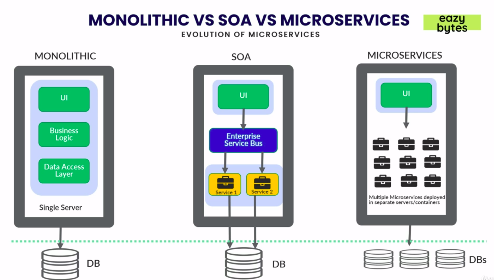
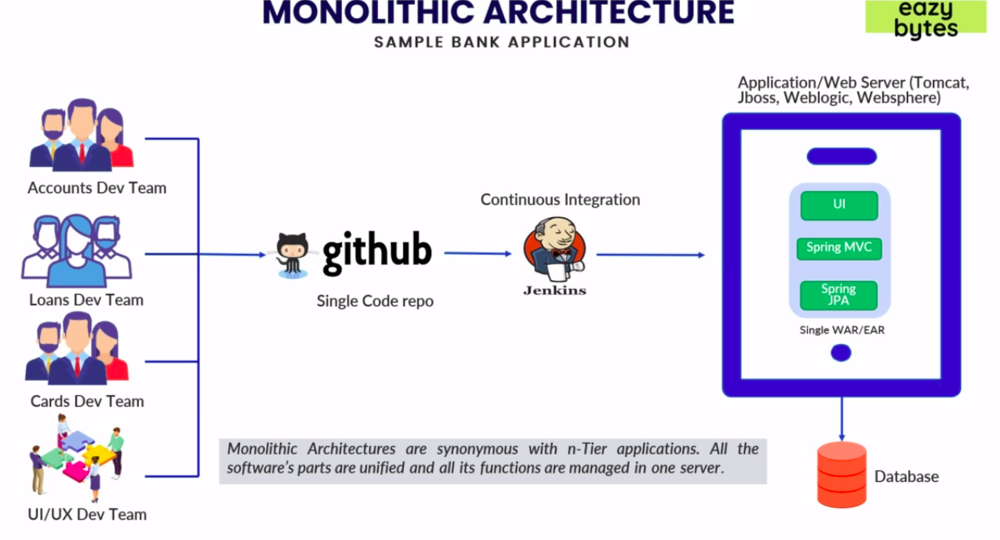
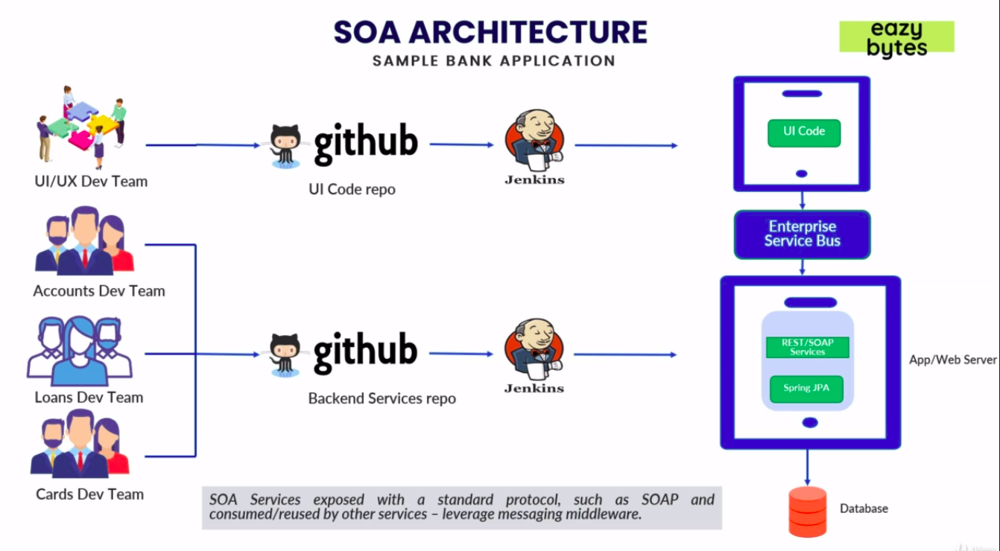
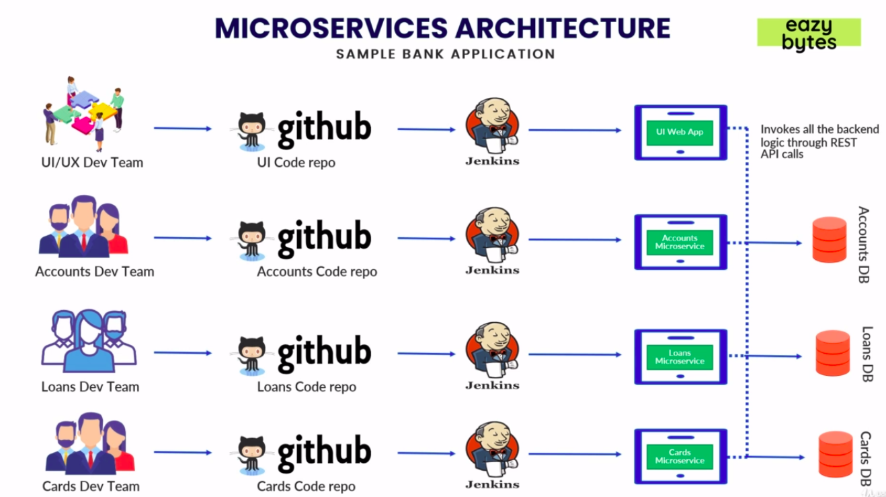
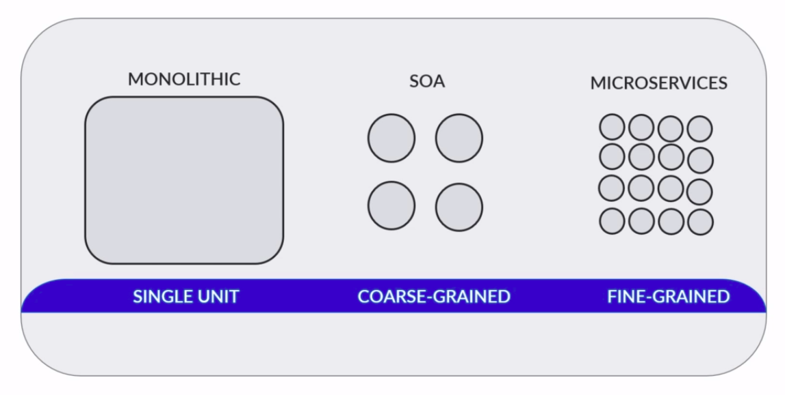
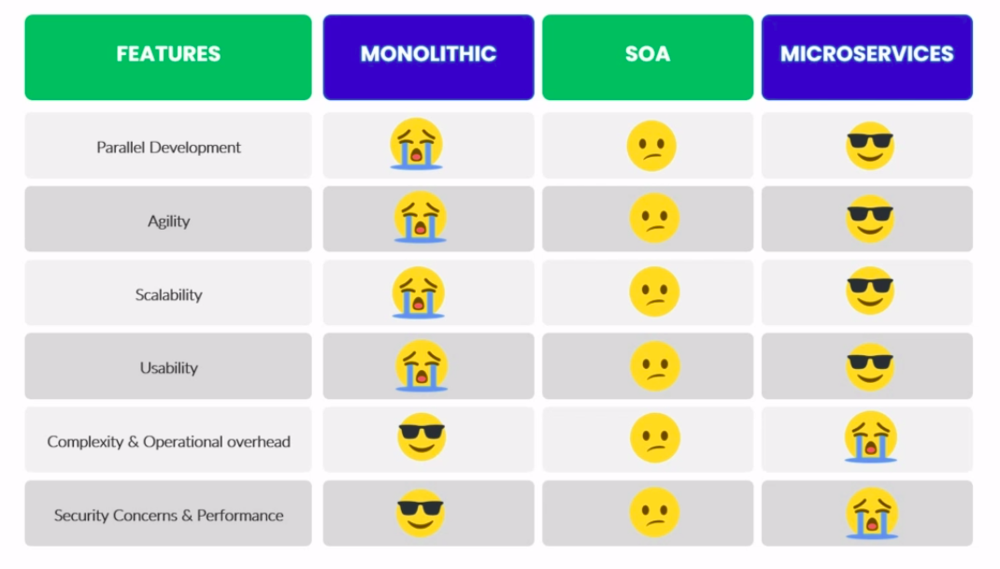
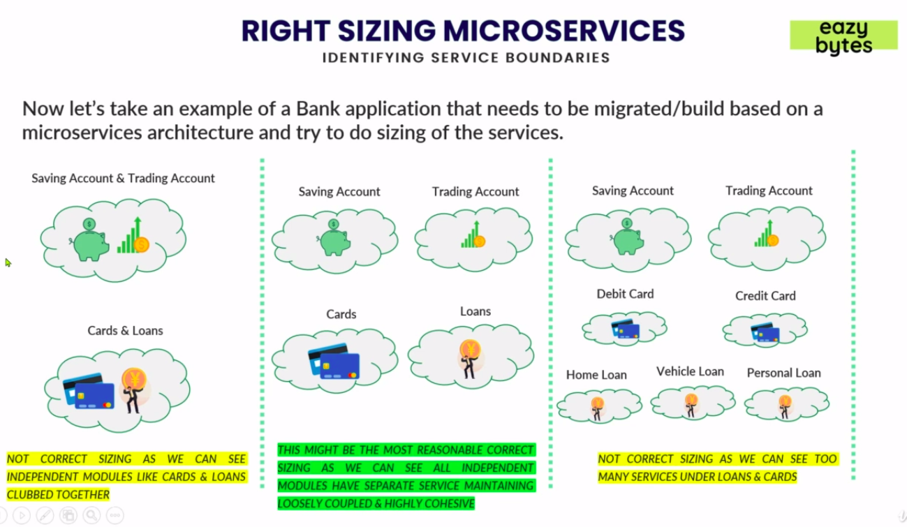
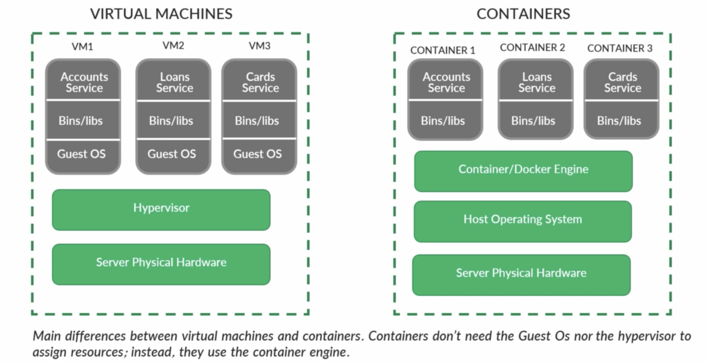
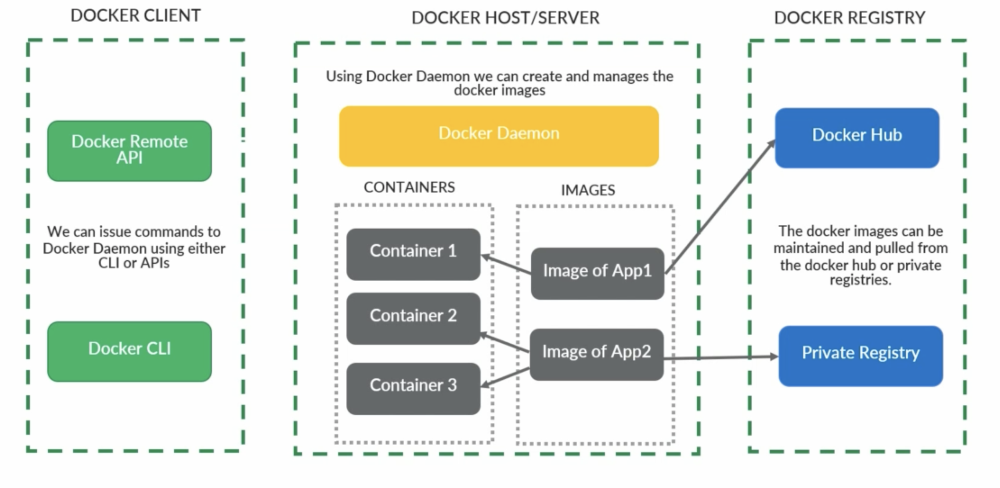

# Evolution of Microservices Architecture



## Deepdive of Monolithic Architecture



* Pros
  * Simpler development and deployment for smaller teams and applications
  * Fewer cross-cutting concerns
  * Better performance due to no network latency

* Cons
  * Difficult to adopt new technologies
  * Limited agility
  * Single code base and difficult to maintain
  * Not Fault tolerance
  * Tiny update and feature development always need a full deployment


# Deepdive of SOA Application



* Pros
  * Reusability of services
  * Better maintainability
  * Higher reliability
  * Parallel development

* Cons
  * Complex management
  * High investment costs
  * Extra overload


# Deepdive of Microservices Architecture



* Pros
  * Easy to develop, test, and deploy
  * Increased agility
  * Ability to scale horizontally
  * Parallel development

* Cons
  * Complexity
  * Infraestructure overhead
  * Security concerns


# Comparison between Monlithic, SOA & Microservices Architecture




# What are microservices?
* "Microservices is an approach to developing a single application as a suite of small services, each running in its own process and communicating with lightweight mechanisms, built around business capabilities and independently deployable by fully automated deployment machinery." - From article by James Lewis and Martin Fowler's

# Why use spring for microservices?

* Spring is the most popular development framework for building java-based web applications & services. From the Day1, Spring is working on building our code based on principles like loose coupling by using dependency injection. Over the years, Spring framework is envolving by staying relevant in the market.
  * 1 - Building small services using Spring Boot is super easy & fast.
  * 2 - Spring Cloud provides tools for dev to quicly build some of the common patterns in Microservices
  * 3 - Provides production ready features like metrics, security, embbeded servers.
  * 4 - Spring Cloud makes deployment of microservices to cloud easy.
  * 5 - There is a large community of Spring developers who can help & adapt easily.


# Actuator

```
<!-- include all paths provided by actuator -->
management.endpoints.web.exposure.include=*

```


# What is Spring Cloud?

* Spring Cloud provides tools for developers to quickly build some of the common patterns of Microservices.

* Spring Cloud Config
  * Ensures that no matter how many microservices instances you bring up; They will always have the same configuration

* Service Registration and Discovery
  * New services will be registered & later consumers can invoke them through a logical name rather than physical location

* Routing & Tracing
  * Makes sure that all calls to your microserivces go through a single "front door" before the targeted service is invoked & the same will be traced.

* Load Balancing
  * Load Balancing efficiently distributes network traffic to multiple backend servers or server pool.

* Spring Cloud Security
  * Provides features related to token-based security in Spring Boot applications/microservices

* Spring Cloud Netflix
  * Incorporated battle-tested Netflix components include Service Discovery (Eureka), Circuit Breaker (Hystrix), Intelligent Rounting (Zuul) and Client Side Load Balacing (Ribbon)


# Challenge 1 with microservices (Right sizing & identifying service boundaries)

* One of the most challeging aspects of building a successful microservices system is the identification of proper microservice boundaries and defining the size of each microservice.

* Below are the most common followed approaches in the industry
  * Domain-Driving Sizing - Since many of our modifications or enhancements driven by the business needs, we can size/define boundaries of our microservices that are closely aligned with Domain-Driven Design & Business capabilities. But this process takes lot of time and need good domain knowledge.

  * Event Storming Sizing - Conducting an interactive fun session among various stake holder to identify the list of important events in the system like 'Completed Payment', 'Search for a Product' etc. Based on the events we can identify 'Commands', 'Reactions' and can try to group them to a domain-driven services.

* Reference for Event Storming Session: https://www.lucidchart.com/blog/ddd-event-storming

# Right sizing microservices
## Identifying services boundaries

* Now let's take an example of a Bank application that needs to be migrated/build based on a microservices architecture and try to do sizing of the services.




# Challenge 2 with Microservices
## Deployment, Portability & Scalability

* Deployment
  * How do we deploy all the tiny 100s of microservices with less effort & cost?

* Portability
  * How do we move our 100s of microservices across envrinomnets with less effort, configurations & cost.

* Scalability
  * How do we scale our application based on the demand on the fly with minimum effort & cost?


# Containerization Technology - Using Docker



# Intro to Docker
## What are containers & docker

* What is a container?
  * A container is a loosely isolated environment that allows us to build and run software packages. These software packages include the code and all dependencies to run applications quickly and reliably on any computing environmnet. We call these packages container images.

* What is software containerization?
  * Softaware containerization is an OS virtualization method that is used to deploy and run containers without using a virtual machine (VM). Containers can run on physical hardware, in the cloud, VMs, and across multiple OSs.

* What is Docker?
  * Docker is one of the tools that used the idea of the isolated resources to create a set of tools that allows applications to be packaged with all the dependencies installed and ran wherever wanted.

## Docker Architecture



## Create Accounts microservice docker image from the Dockerfile

* Inside accounts
  * mvn install - to create jar
  * docker build . -t eazybytes/accounts
    * It will build an image in your local system. You can see running docker images.
    * The image name will be eazybytes/accounts
  * docker image inspect $CONTAINER_ID
    * See the details about that image.
  * docker run -p 8080:8080 eazybytes/accounts
    * create a countainer using image name
  * docker ps
    * show the containers running
  * docker logs $CONTAINER_ID or docker logs -f $CONTAINER_ID
    * Get logs of that container
    * -f = follow
  * docker stop fc
  * docker ps -a
    * all the containers presented in my server
  * docker start fc $PART_OF_CONTAINER_ID
    * It will start any container with part of container id
  * docker container pause 
  * docker kill $CONTAINER_ID
    * Kill instantly the container
  * docker rm $CONTAINER_ID


# Introduction to Buildpacks

* buildpacks.io
* The job of buildpacks is to etect and gather everything that your application need to build and run successfuly in any cloud provider.
* Buildpacks is a concept and for java application we work with paketo.io

## Creating docker image of Loans microservice using Buildpacks without Dockerfile

```xml
	<build>
		<plugins>
			<plugin>
				<groupId>org.springframework.boot</groupId>
				<artifactId>spring-boot-maven-plugin</artifactId>
				<configuration>
          <!-- image name for this microservice -->
					<image>
						<name>eazybytes/${project.artifactId}</name>
					</image>
				</configuration>
			</plugin>
		</plugins>
	</build>
```

* Inside loans run:
  * mvn spring-boot:build-image
    * It will create a docker image


# Pushing Docker images from your local to remote hub repository
