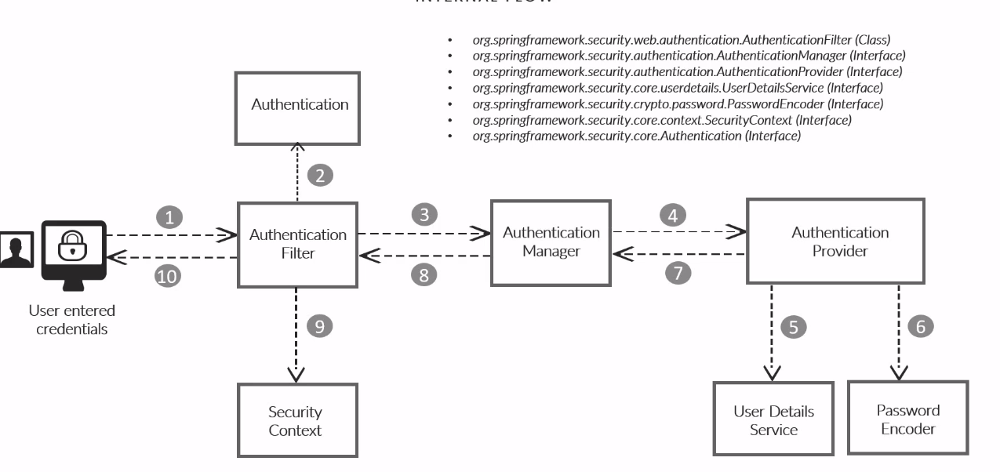
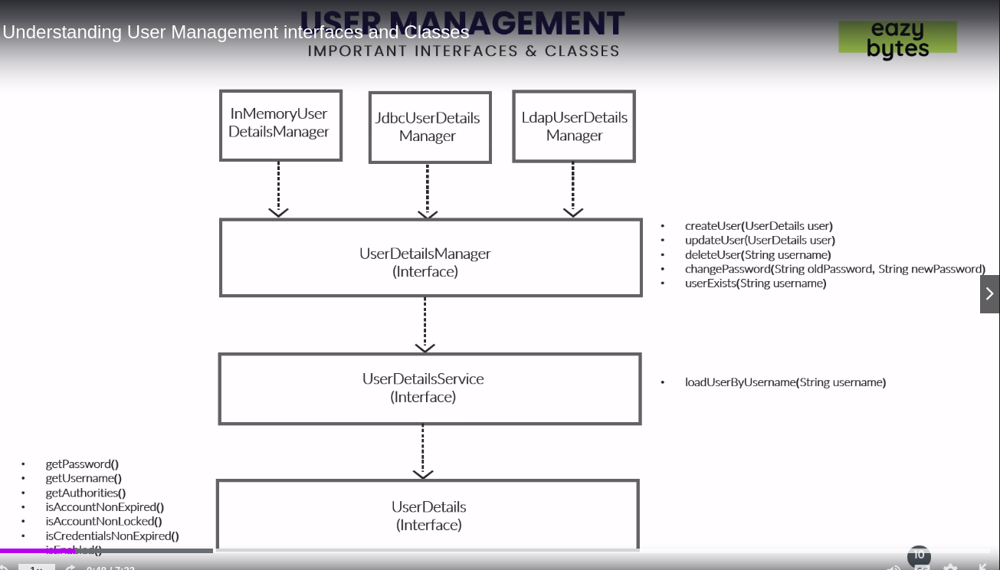

# Introduction to Security

* What is Security?
  * Security is for protecting your data and business logic inside your web application.

* Security is an non fun req
  * Security is very important similar to scalability, performance and availability. No client will specifically asks that I need security.

* Security from dev phase
  * Security should be considered right from development phase itself along with business logic.

* Different types of security
  * Security for a web application will be implemented in different way like using firewalls, HTTPS, SSL, Authentication, AUthorization etc.

* Why security important?
  * Security doesn't mean only loosing data or money but also the brand and trust from your users which you have built over years.

* Avoiding most common attacks
  * Using SEcurity we should also avoid most common security attacks like CSRF, Broken Authentication inside our application.

## Spring Security Flow

* Internal Flow





## Application Endpoints

* Backend Rest Services

* Services with out any security
  * /contact - This service should accept the detail from the Contact Us page in the UI and save to the DB.
  * /notices - This service should send the notice details from the DB to the 'NOTICES' page in the UI.

* Services with Security
  * /myAccount - This service should send the account details of the logged in user from the DB to the UI.
  * /myBalance - This service should send the balance and transaction details of the logged in user from the DB to the UI
  * /myLoans - This service should send the loan details of the logged in user from the DB to the UI
  * /myCards - This service should send the card details of the logged in user from the DB to the UI


## User Management



* We need to implement UserDetails loadUserByUsername(String username) at UserDetailsService

## Creating Users inside the DB as per JdbcUserDetailsManager class

* Script MySQL

```sql

create database eazybank;

use eazybank;

-- Using JdbcUserDetailsManager WE NEED TO CREATE A TABLE CALLED users

CREATE TABLE `users` (
  `id` INT NOT NULL AUTO_INCREMENT,
  `username` VARCHAR(45) NOT NULL,
  `password` VARCHAR(45) NOT NULL,
  `enabled` INT NOT NULL,
  PRIMARY KEY (`id`));

-- authorities is waited too
CREATE TABLE `authorities` (
  `id` INT NOT NULL AUTO_INCREMENT,
  `username` VARCHAR(45) NOT NULL,
  `authority` VARCHAR(45) NOT NULL,
  PRIMARY KEY (`id`));

INSERT IGNORE INTO `users` VALUES(NULL, 'happy', '12345', '1');
INSERT IGNORE INTO `authorities` VALUES(NULL, 'happy', 'write');

```

## Creating custom implementation of UserDetailsService

```sql
CREATE TABLE `customer` (
  `id` INT NOT NULL AUTO_INCREMENT,
  `email` VARCHAR(45) NOT NULL,
  `pwd` VARCHAR(45) NOT NULL,
  `role` VARCHAR(45) NOT NULL,
  PRIMARY KEY (`id`)
);

INSERT IGNORE INTO `customer` VALUES(NULL, 'gustavo@example.com', '54321', 'admin');

```